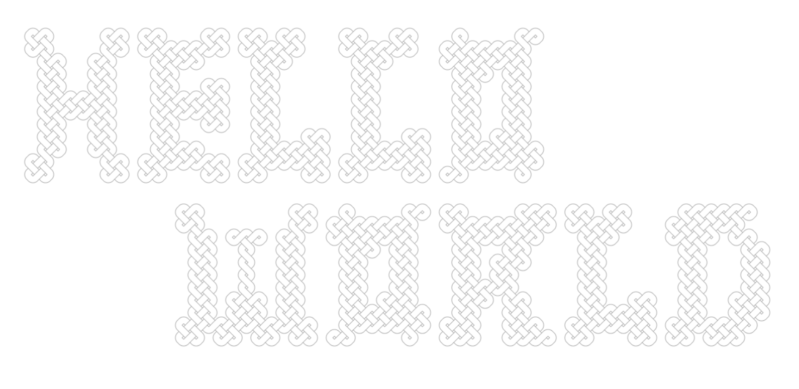

# [Interweaving](https://mathletema.github.io/interweaving)



Program that converts pixel art into interweaved design. A friend of mine taught me how to create hand drawn woven rectangles in 6th grade. I soon made changes to the technique so I could make letters. The process felt mechanical and tedious, so I made a program for it!

See a live demo [Here] (https://mathletema.github.io/interweaving).

## How to use

You will first be presented with a gridded drawing board. Select as many pixels as you want to color black. When you're done, press ```Enter```, and your pixel art will be converted into interweaved design!
